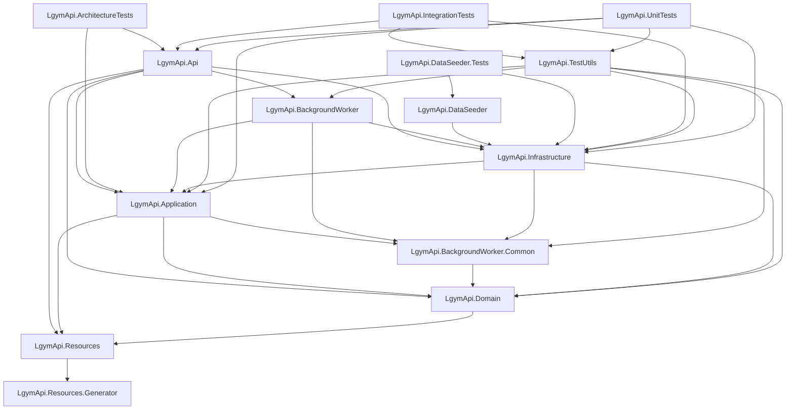

# Issue #375 — Current Project-Reference Graph

This document captures the current solution-state graph only. It uses tracked `.csproj` `ProjectReference` items and does not infer dependencies from namespaces, folders, or runtime behavior.

## Solution projects

1. `LgymApi.Api`
2. `LgymApi.Domain`
3. `LgymApi.Application`
4. `LgymApi.Infrastructure`
5. `LgymApi.Resources`
6. `LgymApi.Resources.Generator`
7. `LgymApi.IntegrationTests`
8. `LgymApi.UnitTests`
9. `LgymApi.ArchitectureTests`
10. `LgymApi.DataSeeder`
11. `LgymApi.DataSeeder.Tests`
12. `LgymApi.BackgroundWorker`
13. `LgymApi.BackgroundWorker.Common`
14. `LgymApi.TestUtils`

## Mermaid graph

## Readable edge list

Sources are listed in solution order; targets are sorted alphabetically within each source.

- `LgymApi.Api` → `LgymApi.Application`, `LgymApi.BackgroundWorker`, `LgymApi.Domain`, `LgymApi.Infrastructure`, `LgymApi.Resources`
- `LgymApi.Application` → `LgymApi.BackgroundWorker.Common`, `LgymApi.Domain`, `LgymApi.Resources`
- `LgymApi.ArchitectureTests` → `LgymApi.Api`, `LgymApi.Application`
- `LgymApi.BackgroundWorker` → `LgymApi.Application`, `LgymApi.BackgroundWorker.Common`, `LgymApi.Infrastructure`
- `LgymApi.BackgroundWorker.Common` → `LgymApi.Domain`
- `LgymApi.DataSeeder` → `LgymApi.Infrastructure`
- `LgymApi.DataSeeder.Tests` → `LgymApi.DataSeeder`, `LgymApi.Infrastructure`
- `LgymApi.Domain` → `LgymApi.Resources`
- `LgymApi.Infrastructure` → `LgymApi.Application`, `LgymApi.BackgroundWorker.Common`, `LgymApi.Domain`
- `LgymApi.IntegrationTests` → `LgymApi.Api`, `LgymApi.Infrastructure`, `LgymApi.TestUtils`
- `LgymApi.Resources` → `LgymApi.Resources.Generator`
- `LgymApi.Resources.Generator` → _no outgoing project references_
- `LgymApi.TestUtils` → `LgymApi.Application`, `LgymApi.BackgroundWorker`, `LgymApi.BackgroundWorker.Common`, `LgymApi.Domain`, `LgymApi.Infrastructure`
- `LgymApi.UnitTests` → `LgymApi.Api`, `LgymApi.Application`, `LgymApi.Infrastructure`, `LgymApi.TestUtils`
