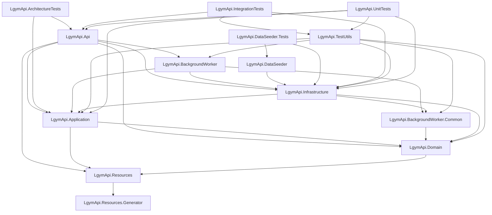

# Issue #380: Current Project-Reference Graph

This is the authoritative current graph after issue #380. It is derived only from tracked `.csproj` `ProjectReference` items. Namespace imports, runtime registration, and transitive build dependencies are not graph edges.

## Solution projects

1. `LgymApi.Api`
2. `LgymApi.Domain`
3. `LgymApi.Application`
4. `LgymApi.Infrastructure`
5. `LgymApi.Resources`
6. `LgymApi.Resources.Generator`
7. `LgymApi.IntegrationTests`
8. `LgymApi.UnitTests`
9. `LgymApi.ArchitectureTests`
10. `LgymApi.DataSeeder`
11. `LgymApi.DataSeeder.Tests`
12. `LgymApi.BackgroundWorker`
13. `LgymApi.BackgroundWorker.Common`
14. `LgymApi.TestUtils`

## Mermaid graph

## Readable edge list

Sources are in solution order. Targets are alphabetical within each source.

- `LgymApi.Api` -> `LgymApi.Application`, `LgymApi.BackgroundWorker`, `LgymApi.Domain`, `LgymApi.Infrastructure`, `LgymApi.Resources`
- `LgymApi.Application` -> `LgymApi.Domain`, `LgymApi.Resources`
- `LgymApi.ArchitectureTests` -> `LgymApi.Api`, `LgymApi.Application`
- `LgymApi.BackgroundWorker` -> `LgymApi.Application`, `LgymApi.BackgroundWorker.Common`, `LgymApi.Infrastructure`
- `LgymApi.BackgroundWorker.Common` -> `LgymApi.Domain`
- `LgymApi.DataSeeder` -> `LgymApi.Infrastructure`
- `LgymApi.DataSeeder.Tests` -> `LgymApi.DataSeeder`, `LgymApi.Infrastructure`
- `LgymApi.Domain` -> `LgymApi.Resources`
- `LgymApi.Infrastructure` -> `LgymApi.Application`, `LgymApi.BackgroundWorker.Common`, `LgymApi.Domain`
- `LgymApi.IntegrationTests` -> `LgymApi.Api`, `LgymApi.Infrastructure`, `LgymApi.TestUtils`
- `LgymApi.Resources` -> `LgymApi.Resources.Generator`
- `LgymApi.Resources.Generator` -> _no outgoing project references_
- `LgymApi.TestUtils` -> `LgymApi.Application`, `LgymApi.BackgroundWorker`, `LgymApi.BackgroundWorker.Common`, `LgymApi.Domain`, `LgymApi.Infrastructure`
- `LgymApi.UnitTests` -> `LgymApi.Api`, `LgymApi.Application`, `LgymApi.Infrastructure`, `LgymApi.TestUtils`

## Historical comparison and audit

The graph has exactly 14 projects and 33 `ProjectReference` edges. Compared with the historical #375 capture, the only edge removed is:

- `LgymApi.Application` -> `LgymApi.BackgroundWorker.Common`

All 33 remaining edges are unchanged from the #375 capture. [issue-375-project-reference-graph.md](issue-375-project-reference-graph.md) preserves that historical edge list. The live `ApplicationBackgroundWorkerDependencyGuardTests` independently verifies that Application has neither the removed project edge nor a semantic source dependency on `LgymApi.BackgroundWorker` namespaces.
